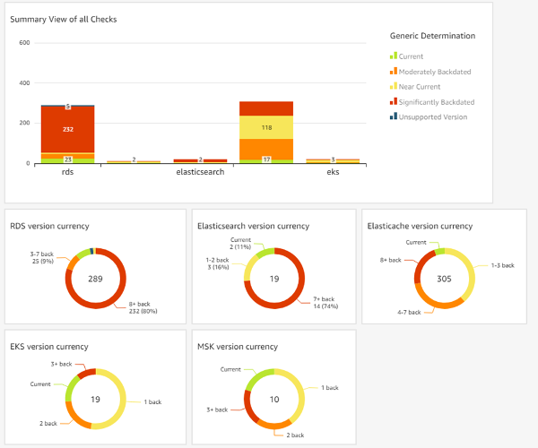

# AWS Check Versions Dashboard

**Status**: Initial MVP
The AWS Check Versions Dashboard project contains source code and documentation for backend code and an Amazon Quicksight dashboard to view the deployed versions for Amazon RDS instances, Amazon Managed Streaming for Apache (MSK), Amazon MQ, Amazon Elasticsearch clusters, Amazon EKS clusters, Amazon ElastiCache clusters, and Amazon DocumentDB (DocDB) clusters vs. the latest available versions for each service.   

The AWS Check Version Dashboard provides two templates to launch the required resources.  You can leverage CloudFormation StackSets to launch ```stackset-role-template.yaml``` into your Organizations child accounts that will create the necessary roles for cross-account access.  Next, you can follow the instructions below to build and deploy a SAM template ```template.yaml``` that will launch all of the necessary resources into an administrator or delegated administrator account.

Example Dashboard using Amazon Quicksight:


## Build application

The Serverless Application Model Command Line Interface (SAM CLI) is an extension of the AWS CLI that adds functionality for building and testing Lambda applications. It uses Docker to run your functions in an Amazon Linux environment that matches Lambda. It can also emulate your application's build environment and API.

To use the SAM CLI, you need the following tools.

* SAM CLI - [Install the SAM CLI](https://docs.aws.amazon.com/serverless-application-model/latest/developerguide/serverless-sam-cli-install.html)
* [Python 3 installed](https://www.python.org/downloads/)
* Docker - [Install Docker community edition](https://hub.docker.com/search/?type=edition&offering=community)

To build and deploy the application: run the following in your shell:

```bash
sam build
sam deploy --guided --capabilities CAPABILITY_NAMED_IAM
```

The first command will build the source of your application. The second command will package and deploy your application to AWS, with a series of prompts:

* **Stack Name**: The name of the stack to deploy to CloudFormation. This should be unique to your account and region, and a good starting point would be check-version-dashboard.
* **AWS Region**: The AWS region you want to deploy your app to.
* **Confirm changes before deploy**: If set to yes, any change sets will be shown to you before execution for manual review. If set to no, the AWS SAM CLI will automatically deploy application changes.
* **Allow SAM CLI IAM role creation**: Many AWS SAM templates, including this example, create AWS IAM roles required for the AWS Lambda function(s) included to access AWS services. By default, these are scoped down to minimum required permissions. To deploy an AWS CloudFormation stack which creates or modified IAM roles, the `CAPABILITY_IAM` value for `capabilities` must be provided. If permission isn't provided through this prompt, to deploy this example you must explicitly pass `--capabilities CAPABILITY_IAM` to the `sam deploy` command.
* **Save arguments to samconfig.toml**: If set to yes, your choices will be saved to a configuration file inside the project, so that in the future you can just re-run `sam deploy` without parameters to deploy changes to your application.

You can find your S3 bucket for the Amazon Quicksight dataset in the output values displayed after deployment.

# Architecture

This application will deploy the following backend resources: 
* An S3 Bucket to host the data in a csv
* A Step Function to coordinate all Lambda functions
* An Event Bridge cron event to trigger the Step Function once a week on Friday Morning.
* 8 Lambda functions that will capture the data for each service and combine into a single csv for Quicksight
* 1 Lambda function that can trigger the step function on demand via updates to the cloudformation template
* Associated IAM permissions for Lambda Functions to make appropriate API calls and for each service in the architecture to communicate with the other service. 

# Build Quicksight Dashboard

To build the QuickSight Dashboard, please refer to: [Build Dashboard](docs/check-versions-quicksight.md)

# Estimated costs: 

Expenses related to this build are estimates only and are based on your specific deployment, amount of data collected and region:
For us-east-1:

1. S3 file: likely less than 1 MB: < $0.000023/mo
2. Step Functions: 4 transitions per month: included in Free Tier
3. Lambda functions: 32 Invokes per month: included in Free Tier
4. Event bridge: 4 Cron events per month: Free
5. Quicksight: Dependant on the number of authors and readers. At least 1 author is needed to build dashboard See [Amazon Quicksight Pricing](https://aws.amazon.com/quicksight/pricing/)
