Build a Check Version Dashboard in AWS QuickSight
=================================================

Overview
--------

This document outlines a process for building meaningful dashboards to visualize the version data generated by the AWS Check  Versions solution. There is no firm definition for the dashboard. This guide only suggests practical techniques to begin the process of making the most of your data. Feel free to adapt your visuals for your own needs. While the ideal solution is to provide a distributable template to create these dashboards automatically, as per an AWS CloudFormation template, AWS QuickSight does not currently support such functionality. Please refer to this guide in lieu of such automation capability is available.

The full scope of visualizations in this guide include: a summary dashboard as an overview of all the services that are checked by the solution as well as five detail dashboards pages that drill into each of the five checked services. For brevity, the summary page and one example of a service check detail page will be shown. You should apply as necessary the techniques to create the detail pages for the other service checks available from the core solution.

There are two essential aspects to address in this guide:
1. Establish a Data Set in QuickSight that links the output of the core Check Versions code with the dashboards you create to visualize it.
1. Create the dashboard visualizations from the Data Set.

_Assumptions: To deploy the dashboard solution described in this document, the user should have already installed the core code portion of this solution. The user should also posess some basic understanding of visualizing data with graphs. Prior AWS QuickSight experience is helpful but not required. Please refer to https://docs.aws.amazon.com/quicksight/ for additional guidance._

Step 1: Establish the Dataset
--------

In this step you will:
* Grant permission for QuickSight to access the S3 bucket created via the installation stack
* Add a data set based on the file produced by the solution
* Create a schedule for automatic data refresh from the S3 source (Optional) 

### _Grant permission for QuickSight to access your S3 bucket_
Begin by launching AWS QuickSight from your web Console.  

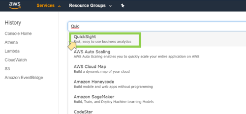

QuickSight requires permission to access S3 bucket. From the QuickSight home screen, make sure you are in the same region into which you deployed your solution. Select your user icon from the top right corner and select "Manage QuickSight."


From the menu that appears on the left, select "Security & permissions."

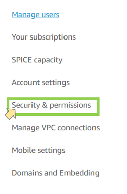

Then "Add or remove."

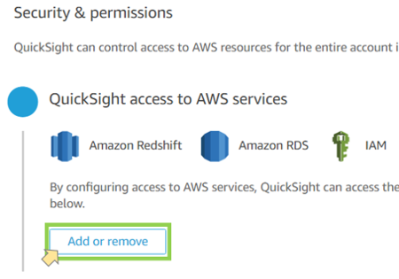

Ensure that "Amazon S3" is checked

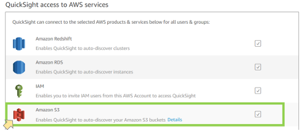

Expand the detail link to define specific buckets to grant permissions to.

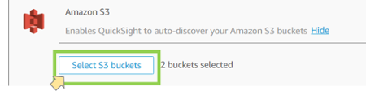

Add the bucket created by the main deployment stack. You do not need to enable the write permission so leave that box unchecked. 

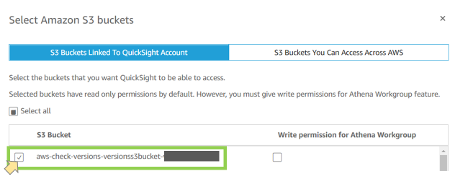

### _Add a data set_
When you are done, select "Finish" at the bottom of the dialog and navigate to the home screen. From the home screen menu select "Manage data"

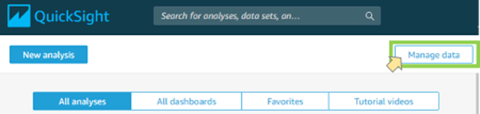

Click "New data set"

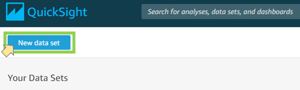

Select "S3" and create a name for your data source name. In this example we used "AwsCheckVersions."

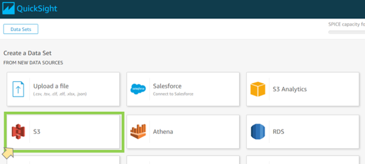

For the next dialog, QuickSight S3 connections require a simple JSON formatted manifest file to indicate the basic metadata of the file object to be imported. You need to create this file manually and you can either make it available as a URL or save it to your local workstation and upload from there. Here is an example of such a file. Note, you should replace the name "version-dashboard-versionss3bucket" with the specific bucket name created by the CloudFormation installation template. That name should appear in the CloudFormation outputs when you executed the stack. Also, we have elected to save it locally so we selected the "Upload" option and clicked the folder icon to browse to the file location:

```JSON
{
    "fileLocations": [
        {
            "URIs": [
                "s3://version-dashboard-versionss3bucket/all_versions.csv"			
            ]
        }
    ],
    "globalUploadSettings": {
        "format": "CSV",
        "delimiter": ",",
        "containsHeader": "true"
    }
}
```
Once ready, click "Connect"

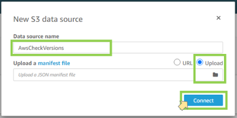

Once the connection is established, you will see a confirmation dialog similar to the following. Click on "Visualize." 

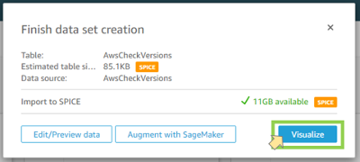

You are now ready to proceed to the next part of this guide where you will create the dashboards. However, we recommend you set up a schedule to refresh the data from S3 on a regular basis. See below.

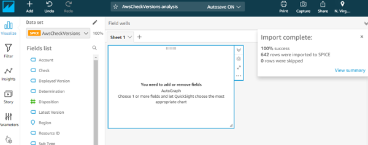

### _Set up automatic data refresh (optional)_
The main solution stack will update the version data file in your S3 bucket according to the schedule you set for it. However, QuickSight by default only imports the existing data at the time the data set was created. It does not have awareness of changes to that underlying file in S3. To be sure you are viewing the most recent data, you need to invoke a refresh operation. A refresh can be done manually or automatically on a schedule of your choosing. We recommend setting a schedule that aligns with the cron schedule for your main solution but at least 1 hour after it runs to be sure that it completes its update.

Begin by selecting "Manage data" from the home page and select the tile for your newly created data set. 

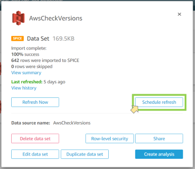

Open the "Schedule refresh" dialog to enter a schedule (note you can refresh you data on-demand from this screen as well).

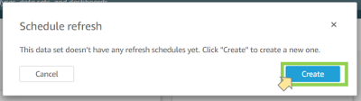

Click "Create" to reveal the schedule options dialog. 

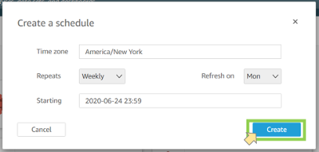

Set your schedule to your suit your needs and click "Create" to establish it.  

Step 2: Create the Dashboards
--------

After creating the necessary Data Set from the previous section, you can now build an analysis from it. If you created the initial analysis by clicking "Visualize" at the end of the Data Set creation an import process, you can skip these first steps.  

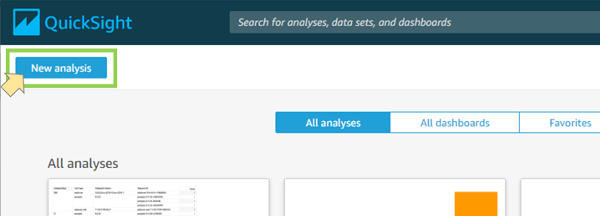

Select the Data Set that was created by the CloudFormation script. In this example, "aws-check-versions-dataset" refers to the appropriate data.

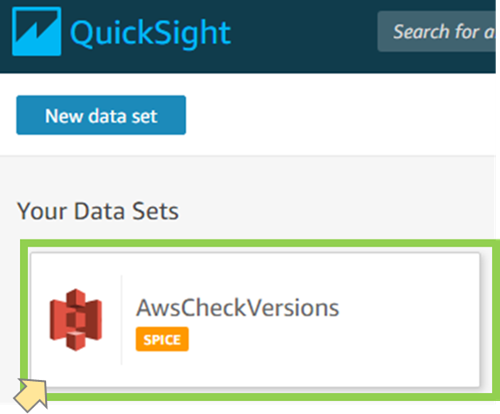

A dialog to create the analysis from the Data Set appears. Select "Create analysis."


You should then see your blank project canvas to begin building visualizations on one or more tabs.

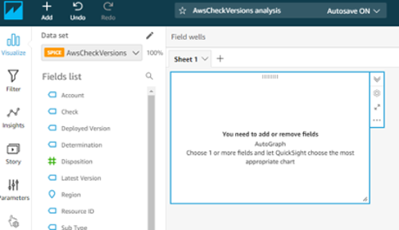

The tabs and visualizations always start with default names so go ahead and rename them as needed. In this case, this first tab is renamed from "Sheet 1" to "Summary View," which represents the high-level, cross-service quick view we are creating first.

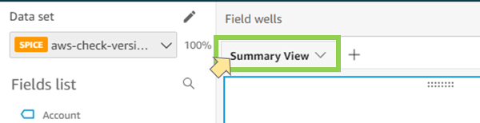

To begin building a visualization, select the type you want from the Visual types options pane (lower left). This example builds a stacked bar graph where each bar represents one of the services in the checks and each segment in the bar depicts a scaled representation of the number of instances of a service that fall into each Generic Determination category. 

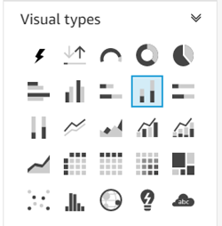

Any given visual type will require two or more minimum data dimensions and potentially additional optionals in order to render an effective chart. The help text for each type provides guidance. Click and drag the appropriate fields for this example as shown in the diagram. They include X axis = Check, Value = Generic Determination, and Group/Color = Generic Determination. The graph should resemble the following. You can also resize the chart according to you needs. You may need to enlarge the size to ensure all textual data is effectively displayed and not automatically obfuscated if QuickSight detects there may be crowding or overlap.

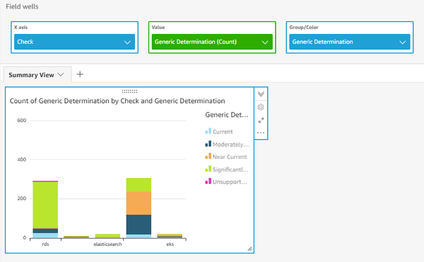

Note that QuickSight applies its own default color scheme. You may wish to manually override that scheme for a more effective visual. In this example, we use a common green, yellow, orange, and red scheme to indicate increasing potential risk based on how out of date some deployed service versions are. The default here depictied "Significantly Backdated" as green, which is not particularly efffective and has some irony to it. You may click on a green bar segment and reassign it to a more appropriate red color, for example, to represent high potential risk. Note, the colors you select should also be appropriate to any accessability requirements for your audience.

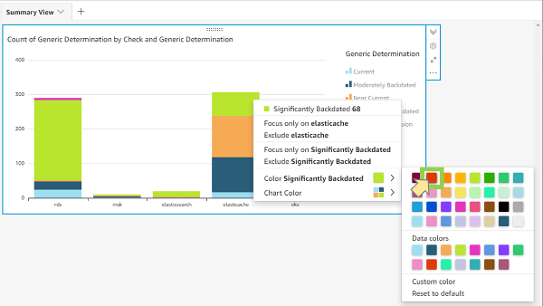

Here is the final color rendering after applying our scheme to each category.

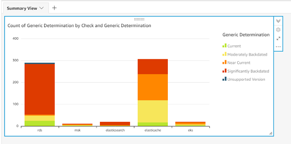

Next we change the title of the graph to something more direct: 

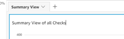

To enhance the Summary tab, we create "Donut" charts to view the disposition of each service at a glance. This is optional. Begin by selecting "+ Add" and "Add visual."

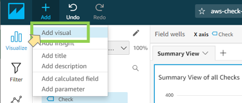

A blank space is added below the summary graph you already created. Select the Donut type option.

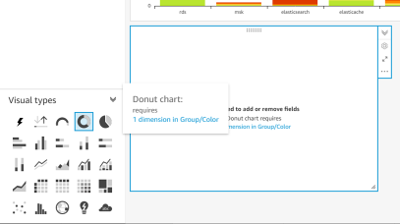

In the Field wells toward the top you see that the Determination field is used. 

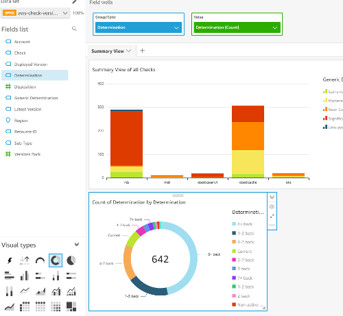

At this point the graph include all services in the checks. QuickSight provides a filter mechanism to narrow down to a single check type. In our example we use RDS. With the graph active, select the filter menu on the left. Then select the + sign to add a new filter and select "Check." 

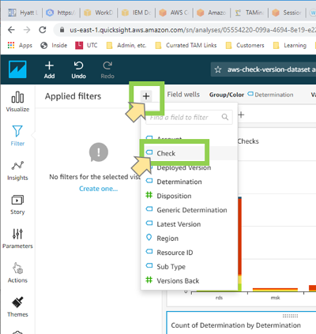

Click on the new filter that now shows: "Check" and "Include - all." We need to select the specific value of rds, rather than including all possible check values.

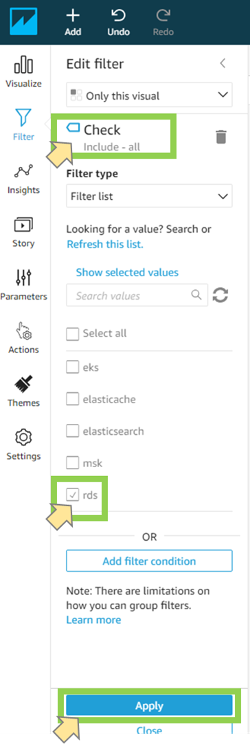

Click the Apply button and your graph will represent only RDS instances in the checks. Note, that same initial default color scheme will be used. Follow the steps as above to change the color representations, if desired. You may also change the chart title to a more meaningful name. Upon doing so you should see something like the following.

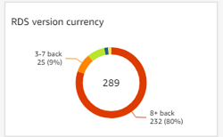

You can follow the pattern to create donut charts for each of the checked services. In our example we also modified graph display options to show labels and hide the legend. Make any such adjustments to meet your own needs. Your dashboard might then look like this:


The next task is to create individual reporting pages/tabs for each service. In our example we created a tab for each service to look like the following:

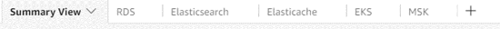

To demonstrate the build for each tab, we will we use RDS as a repeatable an example. RDS is more complicated than other services because there are many different database engine options and each has its own version numbering scheme. Much of that complexity is managed for you by the core functional deployment of this solution, which standardizes the results to fit into the schema used for reporting on all services. 

For the RDS dashboard we recreate the donut graph on the Summary page and further add a new stacked bar graph to differentiate between the database engines as well as a detail matrix to reveal each and every instance identified by the core solution reporting. For additional value, we use QuickSight Actions to enable an interactive experience with dynamic filtering. So, for example, clicking on MySQL in the new bar graph will filter the matrix to show only the MySQL instances. Clicking the disposition in the donut chart can further refine the matrix to show only significantly backdated MySQL instances.

To begin, you can create a copy of the RDS donut graph from the summary tab and place it on the RDS tab.

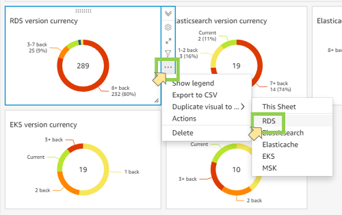

On the RDS tab, add a new visual and select a stacked bar chart. Set the options in the Field wells as X axis = Sub Type, Value = Determination (Count), and Group/Color = Determination. Set your color scheme again, if desired. Then add a filter to the RDS Check field, as you did on the donut graph. It should resemble this:

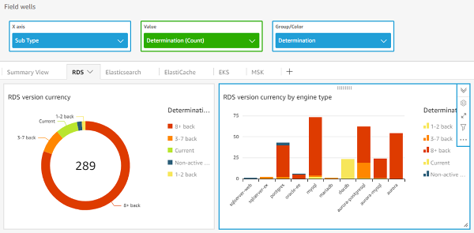

Next, create a pivot table chart on the same tab by adding a new visual as you did before.


Populate the Field wells per the following:

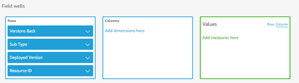

Add a Filter on the Check field, setting it to "rds," as before. In this case we renamed the title to "RDS Resources." The resulting matrix will look like this. 

_Note that the Resource IDs reflect fake names for this example. In your case the specific resources in your account will be listed._

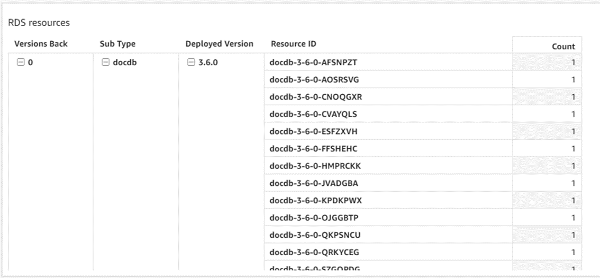

The pivot table matrix by default will show all of your resources across all RDS engine types, which can be quite long and harder to sift through. You can implement Actions in QuickSight to add a dynamic filter to better pinpoint groups of instances. Begin by selecting the bar chart you created and expanding the ellispis on the context menu to reveal the "Actions" menu. 

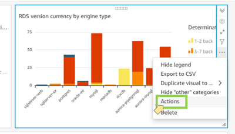

Click the + or the "Define a custom action" button.

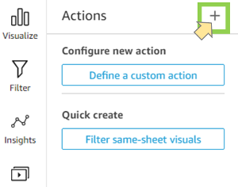

In the New action dialog, set the Filter scope to "Selected fields" and make sure the values "Sub Type" (i.e. RDS engine type) and "Determination" are checked. You can target both of the other visuals on the page if you want but here we target just the matix "RDS resources." Check the appropriate Target visuals box(es) for your needs. The configuration should look like this:

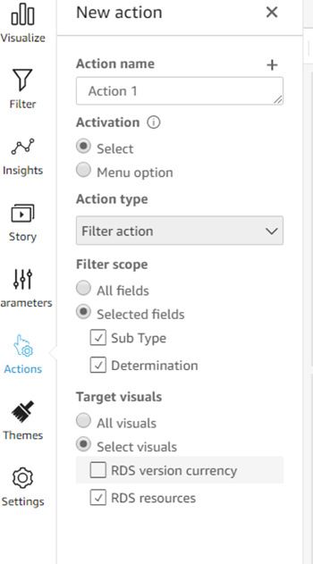

Click the Save button at the bottom. Now when you click on one of the bar segments from the stacked bar graph, the matrix will be automatically filtered to show the reources within that category. Here we selected the heavily backdated mysql instances in the bar chart and the matrix now shows the relevant instances.


You can add a similar action to the donut chart to also filter the matrix. In that case you can only scope the filter on the determination as the "Sub Type" field is not used in that graph, only the Determination is. 

You can repeat the steps above for each service check page. Note that RDS and ElastiCache are the only current checks that have a relevant Sub Type. For RDS it is the engine type and for ElastiCache it is Redis or Memcached. So the stacked bar graph created above for RDS is only useful for ElastiCache. You can simply use the donut graph and a detail matrix. Apply any dynamic filter actions as you need them.
